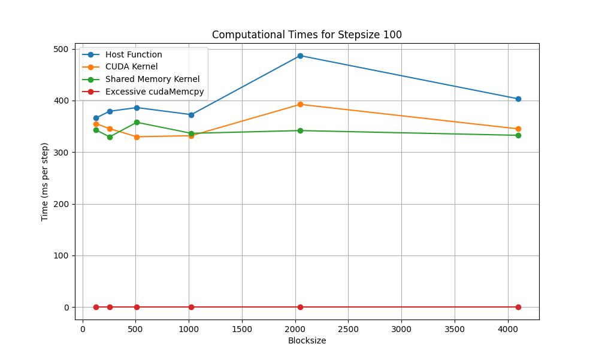
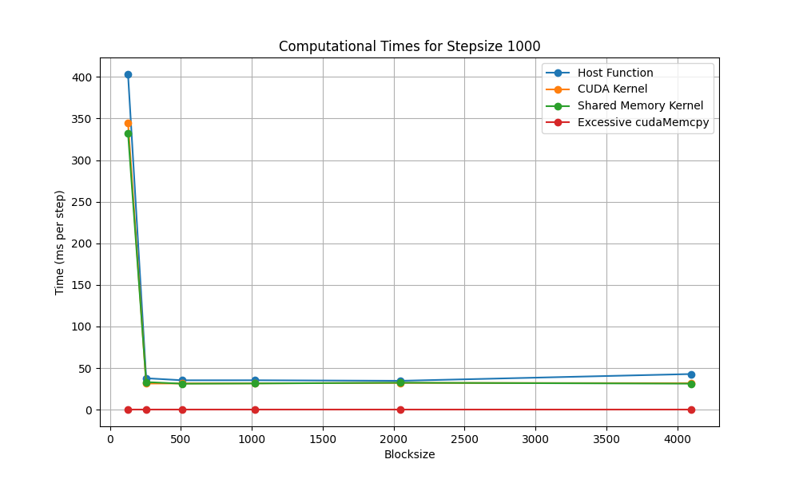
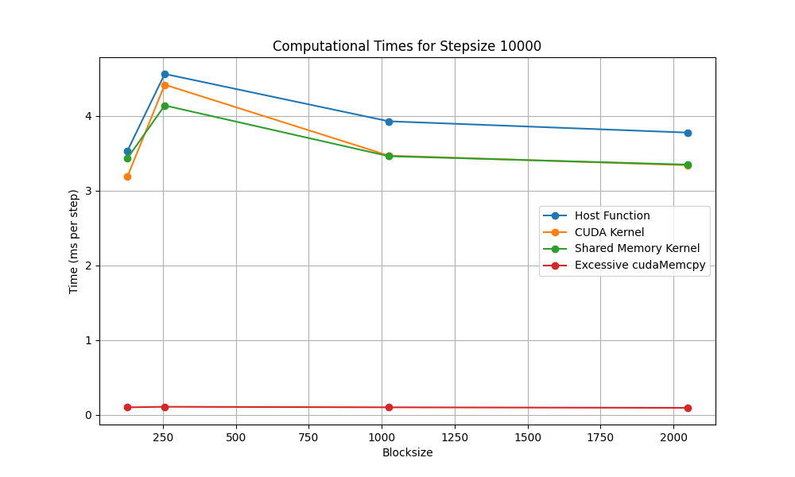

1. module load GCC/7.3.0-2.30 GNU/7.3.0-2.30 CUDA/9.2.88
2. nvcc diffusion.cu -o diffusion
3. ./diffusion blocksize nsteps
    for example: ./diffusion 256 100
4. make sure a folder named "data" exists
5. python3 plotting.py to plot

# Report: Project 5

1. Report your timings for the host, naive CUDA kernel, shared memory CUDA kernel, and the excessive memory copying case, using block dimensions of 256, 512, and 1024. Use a grid size of 2^15+2*NG (or larger) and run for 100 steps (or shorter, if it's taking too long). Remember to use -O3!

To supplement the the analysis, we performed the three variants for the timings of the host, naive CUDA kernel, shared memory CUDA kernel, and the excessive memory copying for block dimensions 128, 256, 512, 1024, and 2048 by keeping step size constant at 100, 1,000, and 10,000 and a grid size of 2^15+2*2 (Ghost cells = 2).  Below are the results of these different implementations. While for each plot it appears that the Excessive CUDA Memcpy is zero, it is consistently between 0.09 - 0.11 across all implentations.

2. How do the GPU implementations compare to the single threaded host code. Is it faster than the theoretical performance of the host if we used all the cores on the CPU?

Based on our results, we see that across all stepsizes and block sizes, the GPU implementations for both naive CUDA and shared memory CUDA kernels, consistently outperform the single-threaded host approach. As mentioned, for each blocksize and stepsize, the computational time for GPU approaches was consistently between 0.09 and 0.11.  Results began to converge more as we increased the step size, but there was still a significant outperformance by the GPU Excessive CUDA Memcpy implementation by around 50-fold at its closest to the host.

In theory, if the host computation scaled linearly across all cores of a CPU, it would require around 50 cores to reach the same performance, but this is only for the implementation where we have stepsize = 10,000.  When stepsize is smaller, the scaling would take an impractically large number of cores to reach and equivalent performance to the Excessive Cuda Memcpy.  This is a pretty idealistic scenario.  It is likely that memory access bottlenecks and communication overhead would prevent this from being a perfectly scalable implementation.

3. For the naive kernel, the shared memory kernel, and the excessive memcpy case, which is the slowest? Why? How might you design a larger code to avoid this slow down?

If we're considering the overall computation/execution times and not just the memory operations, we might suspect the naive CUDA kernel to be the slowest.  It's 'Naive' implementation does not well optimize the GPU because it does not take advantage of the shared memory but rather uses the global memory, limiting its potential. Also in the Excessive memory copying implentation the overhead costs of transferring data would likely grow at a faster rate relative to its computation/execution time if we begin to use larger amounts of data, weighing down its execution/computational efficiency.

In the naive example, as we stated, one way to more efficiently design this code would be to reduce the number of accesses to its global memory and to take advantage of the shared memory.  Other approaches would be to design the kernel to maximize repeated data use within each block before fetching new data into shared memory.  For the Excessive memcpy case, we could try to limit the instances of unnecessary data transfers between the CPU and GPU. If the GPU spends a significant amount of time waiting for data to be transferred from the host before it can begin processing, latency will be its main bottleneck and cause inefficiencies.

4. Do you see a slow down when you increase the block dimension? Why? Consider that multiple blocks may run on a single multiprocessor simultaneously, sharing the same shared memory.

Only marginally and it generally plateaus as blocksize becomes larger than 1024.  For stepsize 100, as block size increases from 128 to 2048, both the naive CUDA kernel and shared memory kernel show an increase in computation time, except a decrease from 4096 back to a little over 345 ms per step for CUDA Kernel and 332.527 ms for Shared Memory Kernel. Notably, the shared memory kernel and the naive CUDA kernel become slower from a block size of 512 to 2048, then slightly improve at 4096.  For stepsizes 1,000 and 10,000, similar trends are seen where the times sometimes increase with larger block sizes. However, the variation is not as pronounced as with Stepsize 100, and the execution times are relatively lower.

An explanation for the plateauing of the results might be that increasing block size does not always lead to better performance. Increasing block sizes can lead to a slowdown due to the higher demand on shared resources like memory and registers.  It can cause a slowdown due to greater competition for shared resources and it is not able to utilize all of threads, thus as the blocksizes grows, we are just increasing the block sizes without giving the GPU cores more work.  Thus, larger blocks can demand all of a multiprocessor's capacity, limiting the parallel processing advantages of the GPUs.
